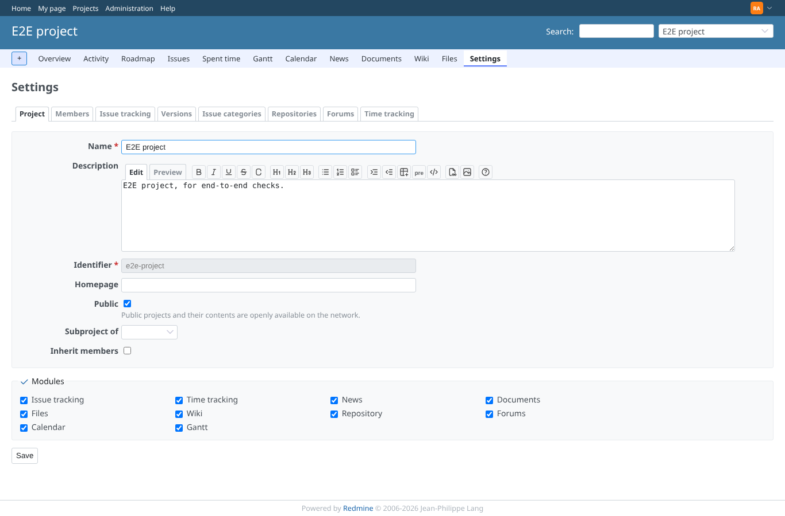
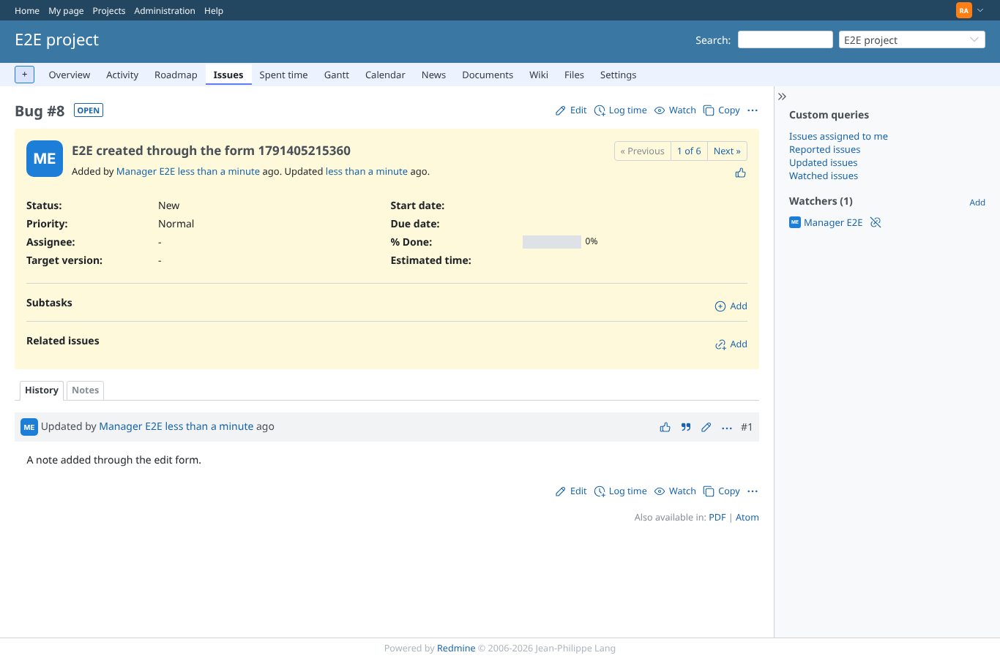
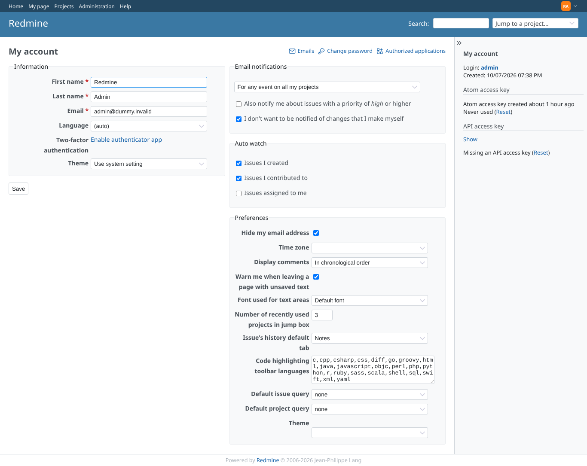
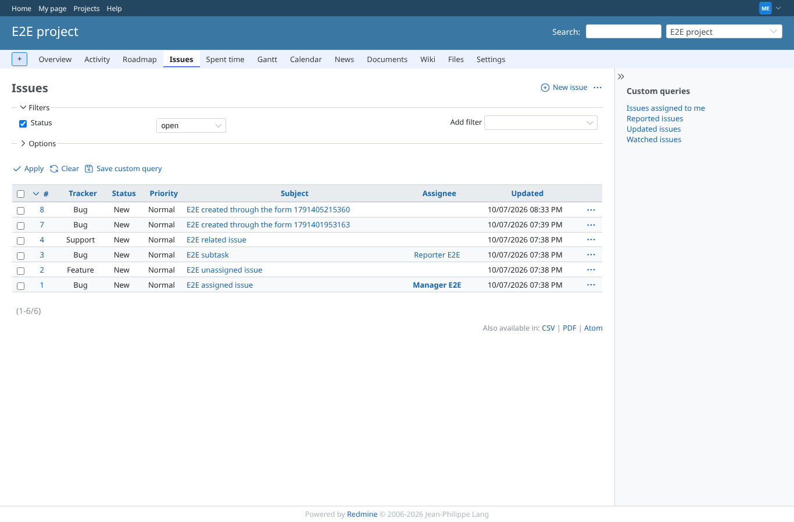
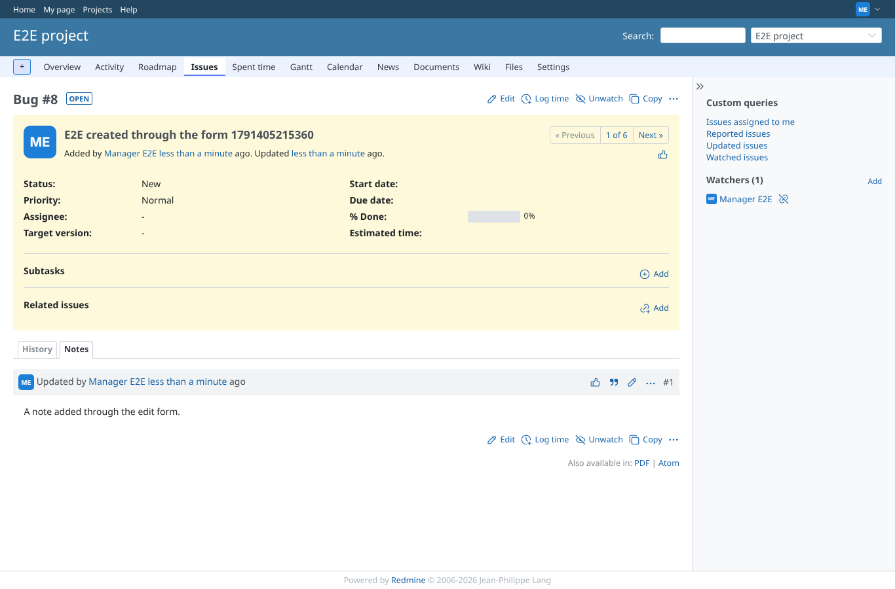
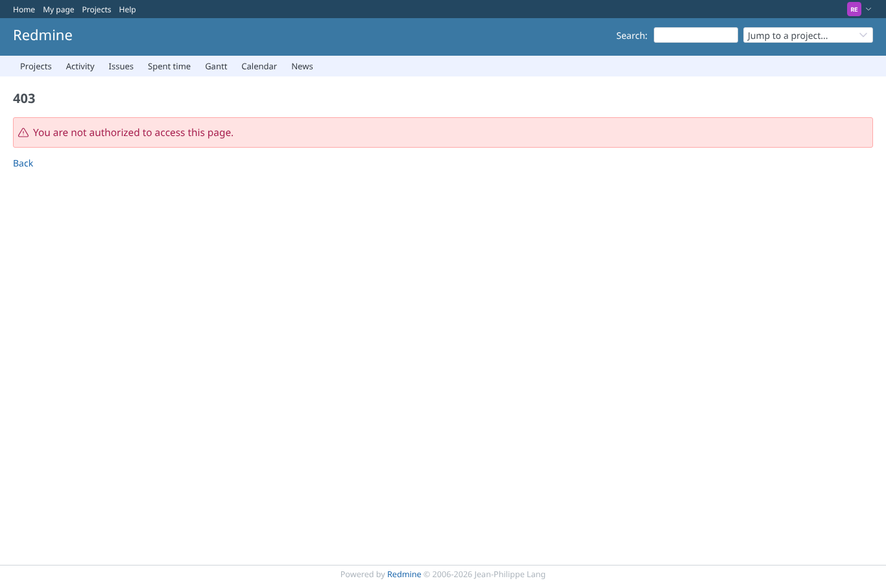

# core-pages

Run 2026-10-07T20:33:55.514Z against http://127.0.0.1:3000.

| screenshot | user | URL | shows |
|---|---|---|---|
|  | admin | `/projects/e2e-project/settings` | admin: Project > Settings answers 200 |
|  | admin | `/projects/e2e-project/issues` | admin: issue list answers 200 |
|  | admin | `/issues/8` | admin: issue page answers 200 |
|  | admin | `/my/account` | admin: My account answers 200 with the theme selector(s) |
|  | manager | `/projects/e2e-project/settings` | manager: Project > Settings answers 200 |
|  | manager | `/projects/e2e-project/issues` | manager: issue list answers 200 |
|  | manager | `/issues/8` | manager: issue page answers 200 |
|  | manager | `/my/account` | manager: My account answers 200 with the theme selector(s) |
|  | reporter | `/projects/e2e-project/settings` | reporter (core Reporter role): Project > Settings refused (403) |
|  | outsider | `/projects/e2e-private/settings` | outsider: settings of the private project refused (403) |
