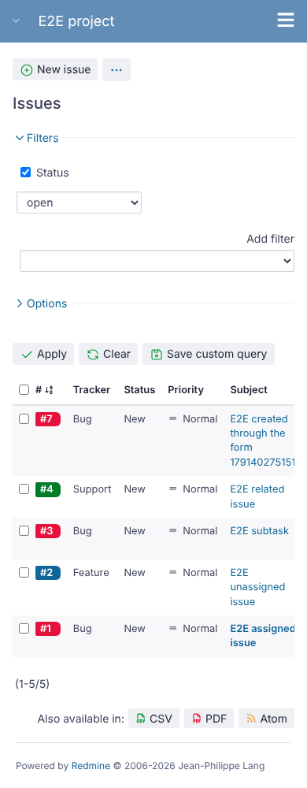
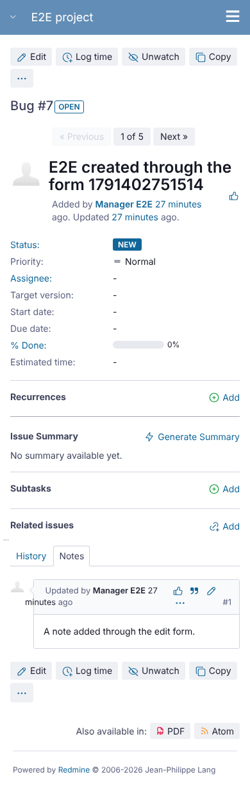
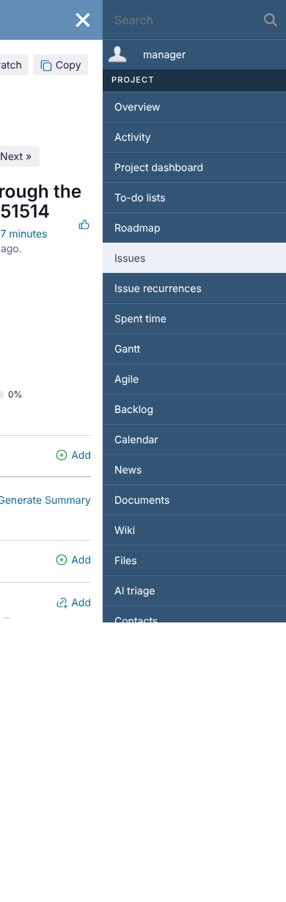
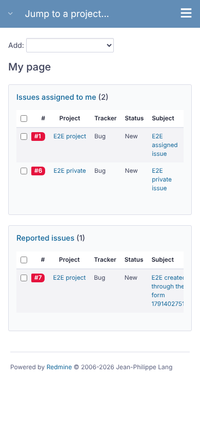

# opale-mobile

Run 2026-10-07T20:19:57.013Z against http://127.0.0.1:3001.

| screenshot | user | URL | shows |
|---|---|---|---|
|  | manager | `/projects/e2e-project/issues` | Mobile width (390px), issue list with Opale |
|  | manager | `/issues/7` | Mobile width, issue page with Opale |
|  | manager | `/issues/7` | Mobile width, flyout menu opened with Opale |
|  | manager | `/my/page` | Mobile width, My page with Opale |
