# opale

Run 2026-10-07T20:19:09.848Z against http://127.0.0.1:3001.

| screenshot | user | URL | shows |
|---|---|---|---|
| 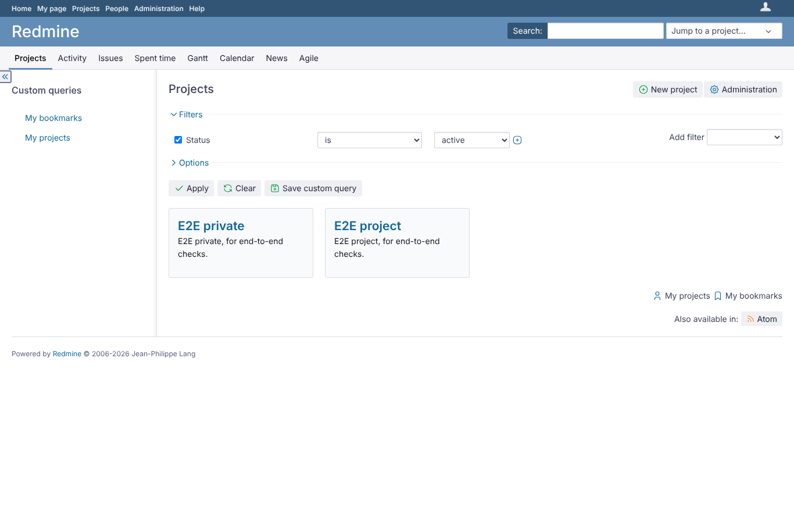 | admin | `/projects` | Admin, project list with Opale |
| 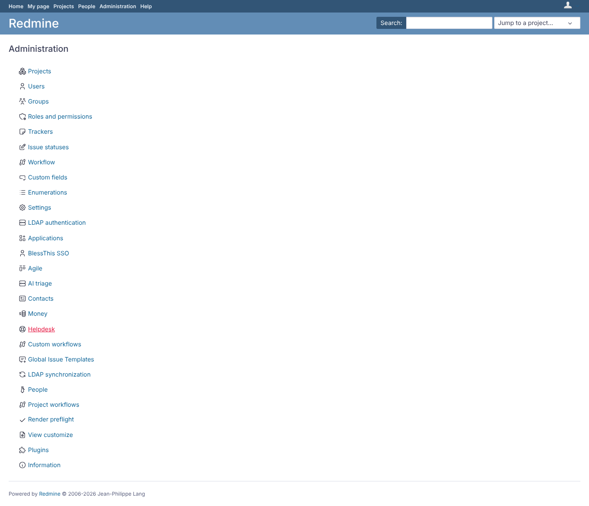 | admin | `/admin` | Administration with Opale |
| 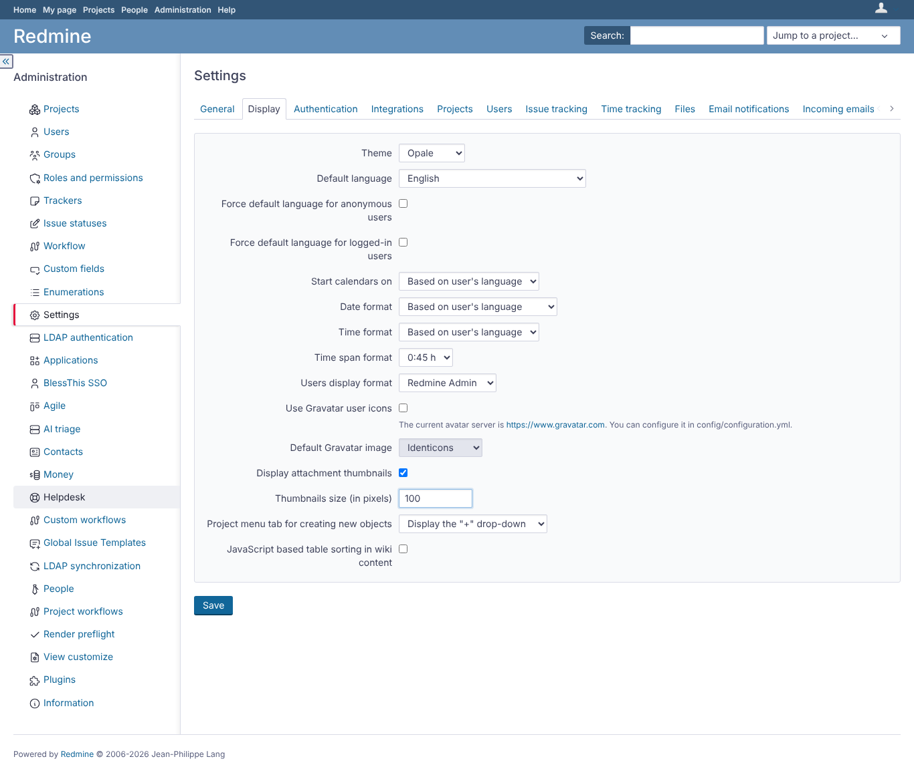 | admin | `/settings?tab=display` | Administration > Settings > Display: Opale selected as the global theme |
| 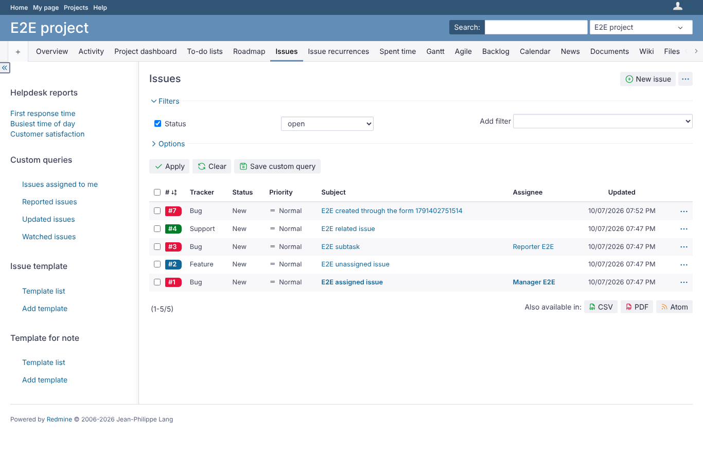 | manager | `/projects/e2e-project/issues` | Manager, issue list with Opale (sidebar, filters, icons) |
| 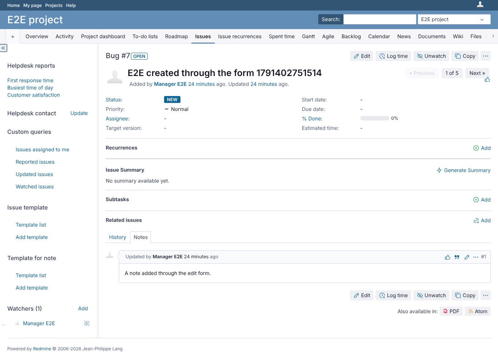 | manager | `/issues/7` | Manager, issue page with Opale |
| 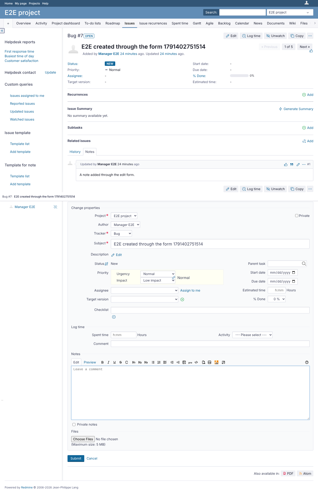 | manager | `/issues/7` | Manager, issue edit form with Opale |
| 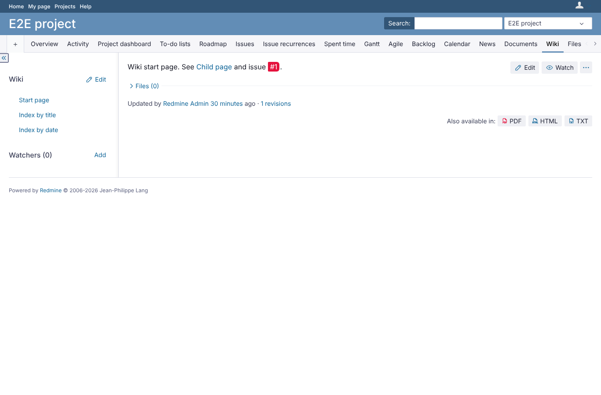 | manager | `/projects/e2e-project/wiki` | Manager, wiki page with Opale |
| 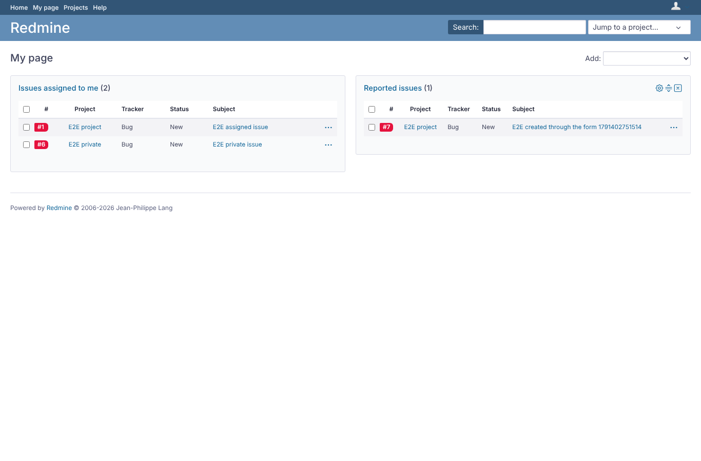 | manager | `/my/page` | Manager, My page with Opale |
| 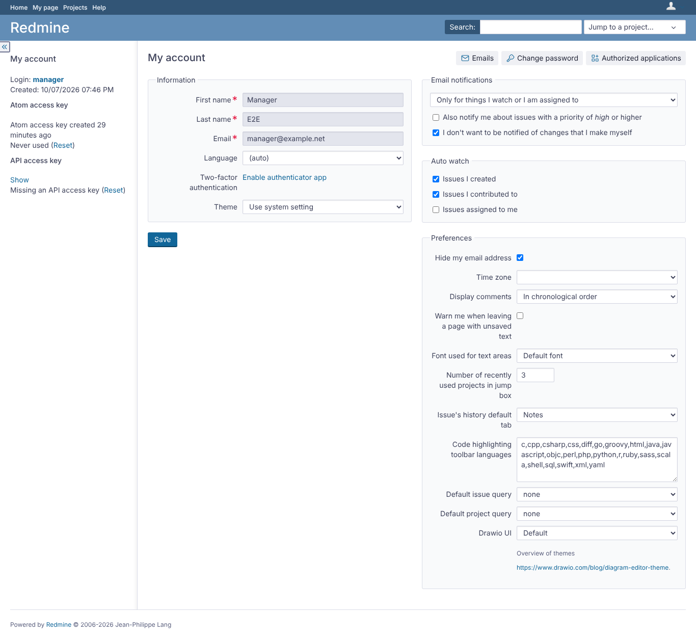 | manager | `/my/account` | Manager, My account with Opale (theme_changer selector) |
| 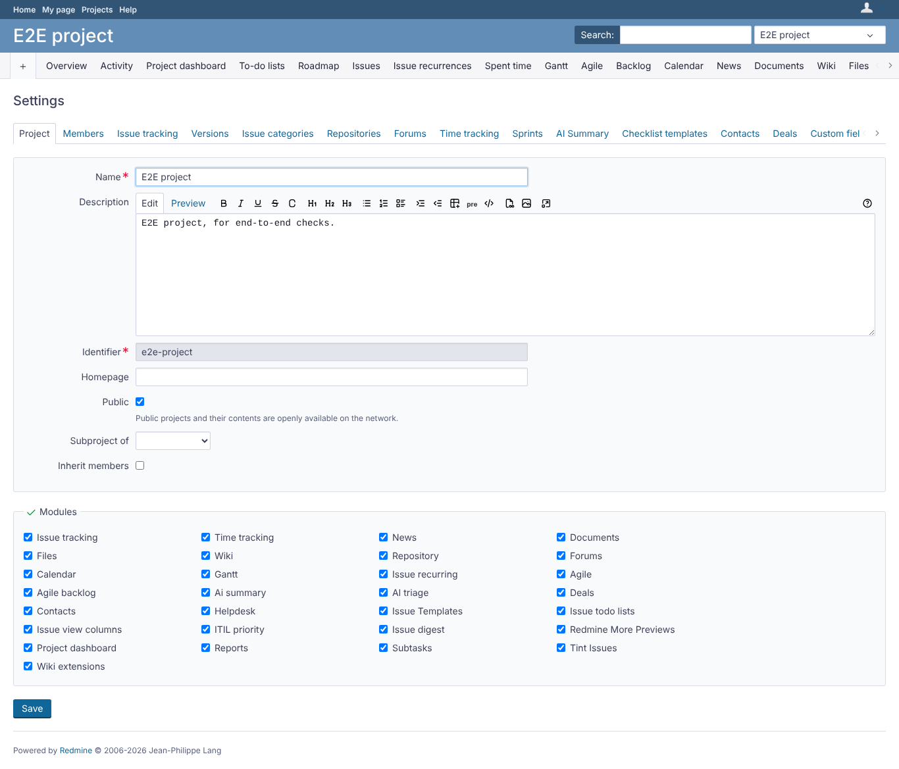 | manager | `/projects/e2e-project/settings` | Manager, project settings with Opale |
|  | reporter | `/issues/7` | Reporter, issue page with Opale (no edit rights beyond the core Reporter role) |
|  | reporter | `/projects/e2e-project/settings` | Reporter: project settings refused (403), error page in Opale |
| 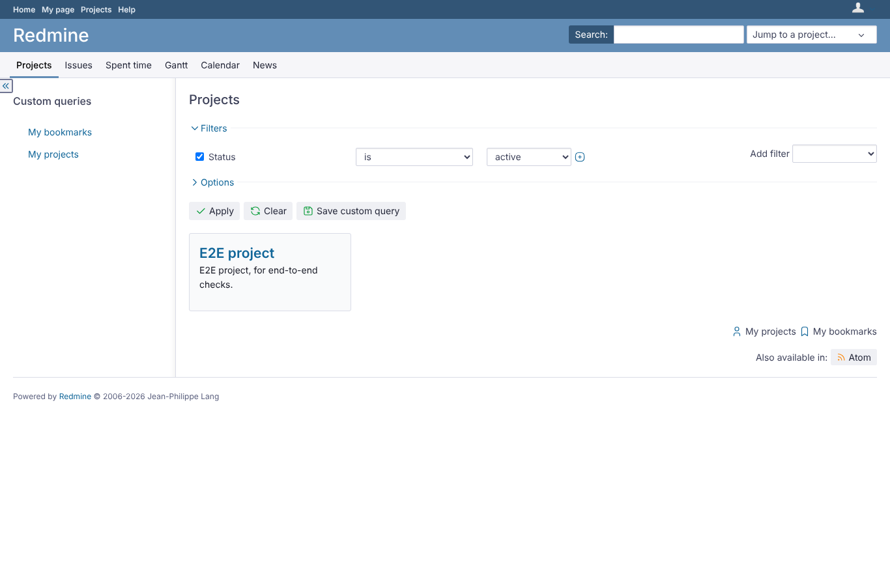 | outsider | `/projects` | Outsider, project list with Opale: the private project is not listed |
| 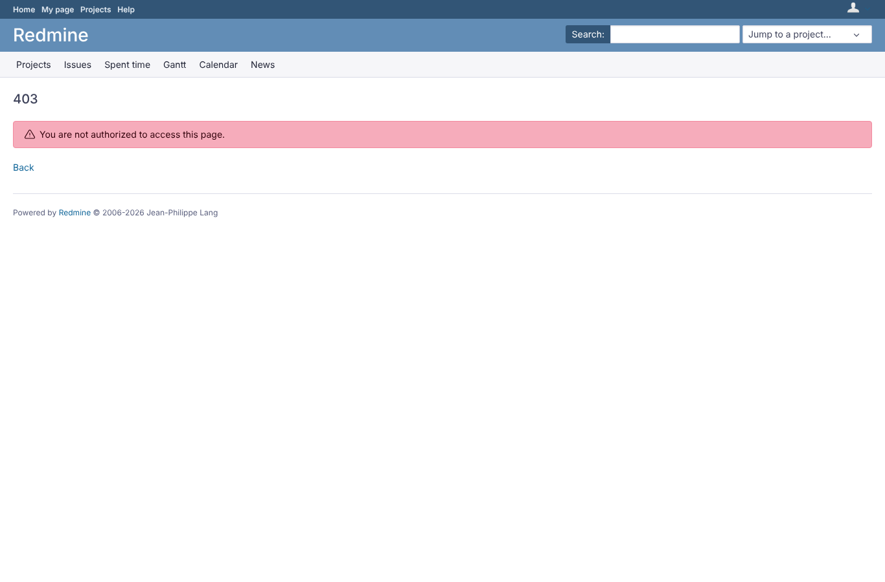 | outsider | `/projects/e2e-private` | Outsider: private project refused (403) in Opale |
| 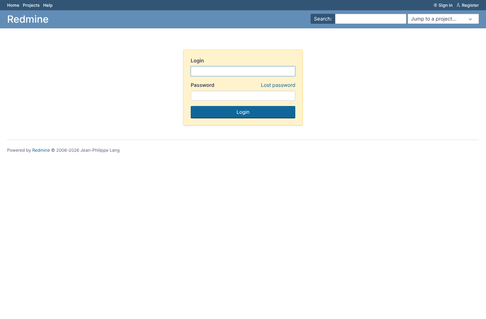 | anonymous | `/login` | Anonymous, login page with Opale |

## Problems

- /issues/7 as reporter: HTTP 403, expected 200
