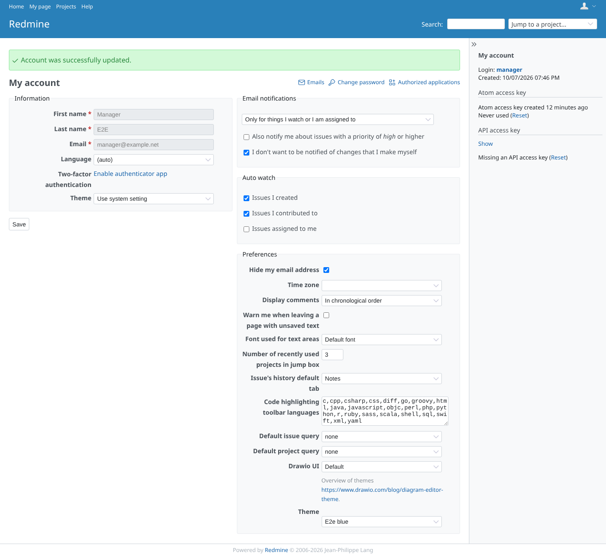
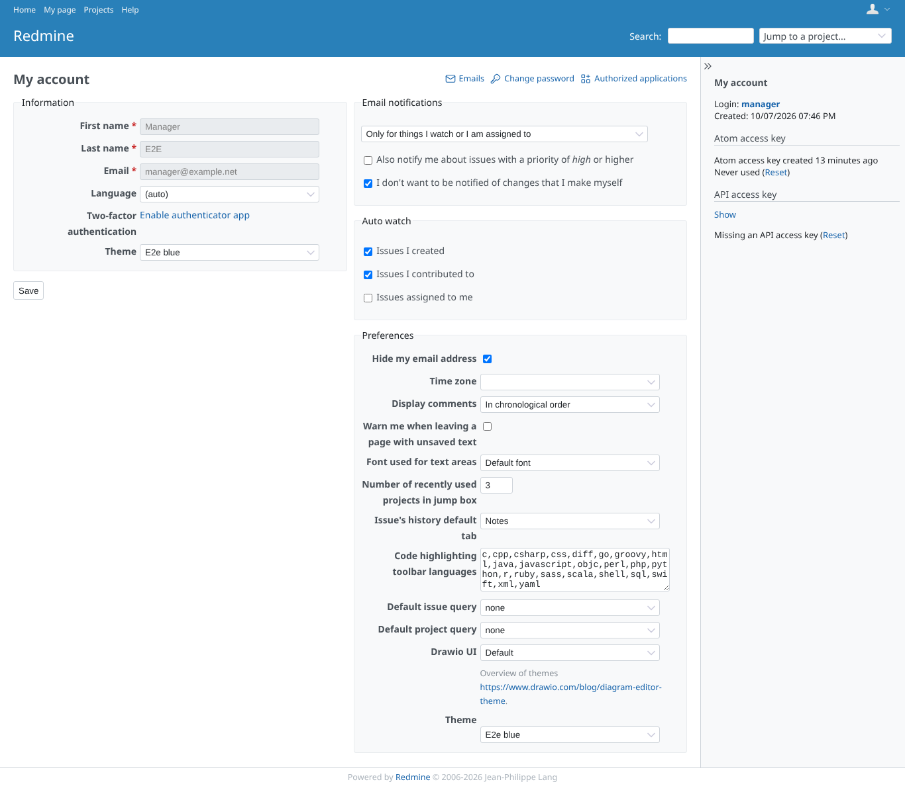
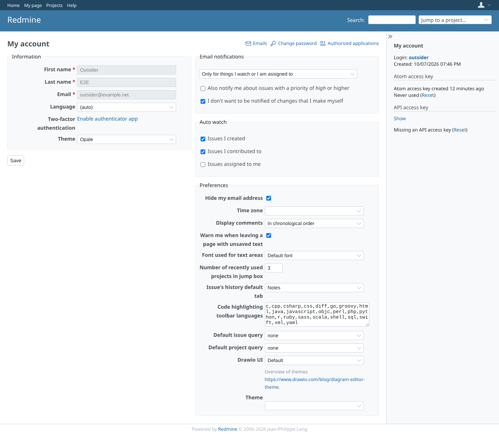
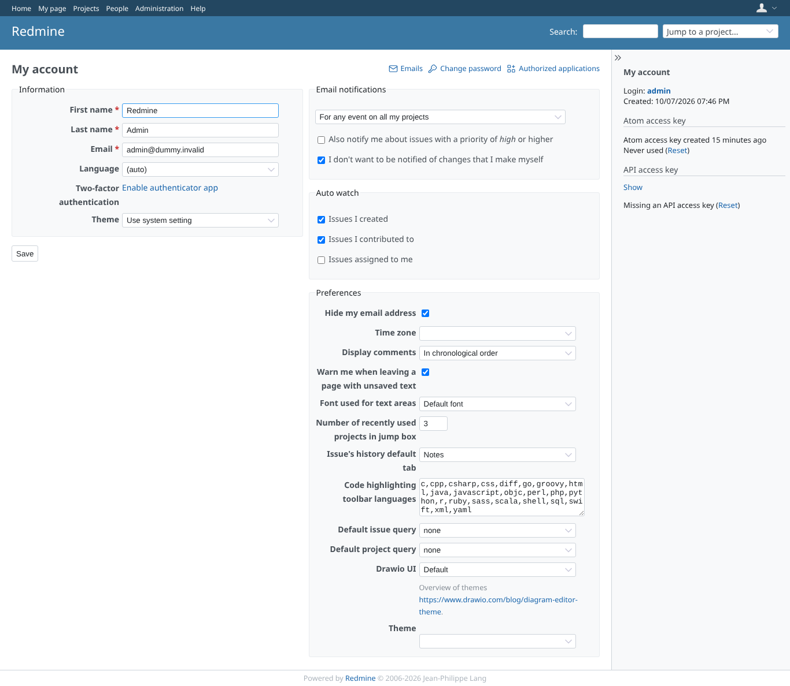
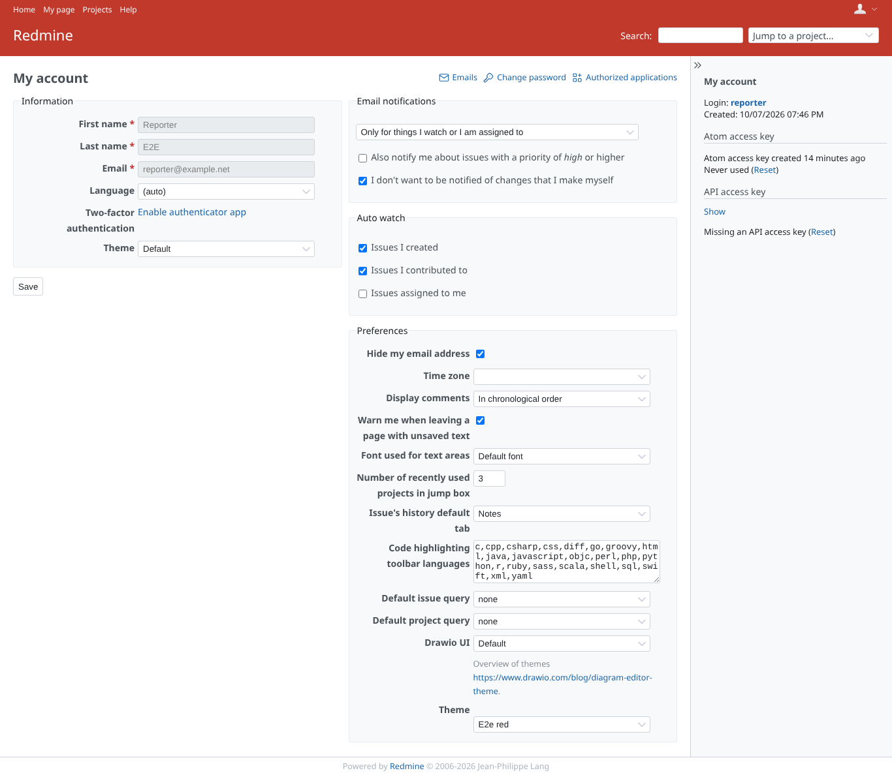

# theme-conversion

Run 2026-10-07T20:04:15.695Z against http://127.0.0.1:3001.

| screenshot | user | URL | shows |
|---|---|---|---|
|  | manager | `/my/account` | Transition: both plugins installed, My account has both Theme selectors; manager chose e2e_blue with this plugin |
|  | manager | `/my/account` | After the conversion: theme_changer's selector shows manager's e2e_blue |
|  | reporter | `/my/account` | Reporter (no plugin permissions): e2e_red carried over |
|  | outsider | `/my/account` | Outsider (no membership): PurpleMine2 choice converted to Opale through THEME_MAP |
|  | outsider | `/projects/e2e-private` | Outsider still cannot open the private project (403) |
|  | admin | `/my/account` | Admin had no personal theme: no row, theme_changer follows the system setting |
|  | reporter | `/my/account` | After revert: reporter keeps the "Default" chosen in theme_changer after the conversion |
