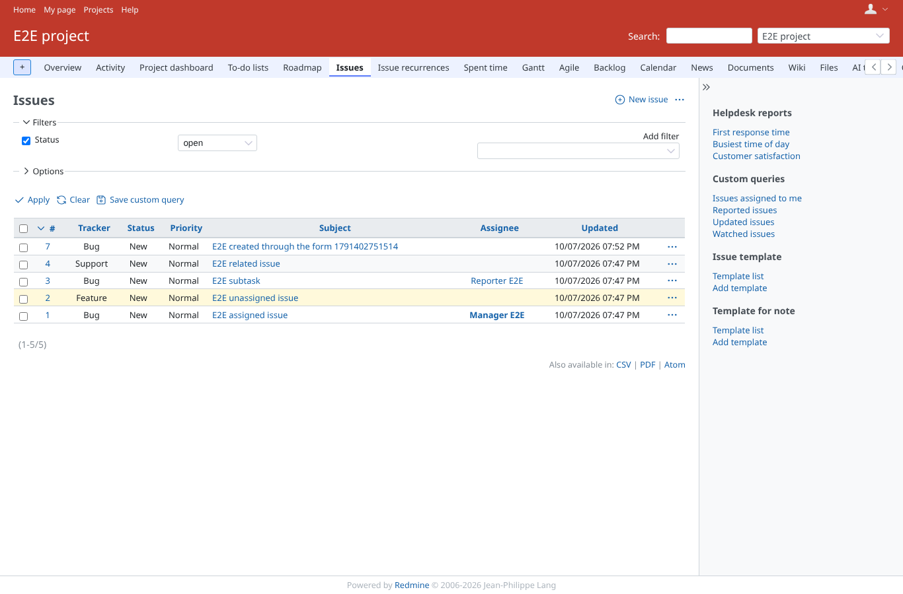
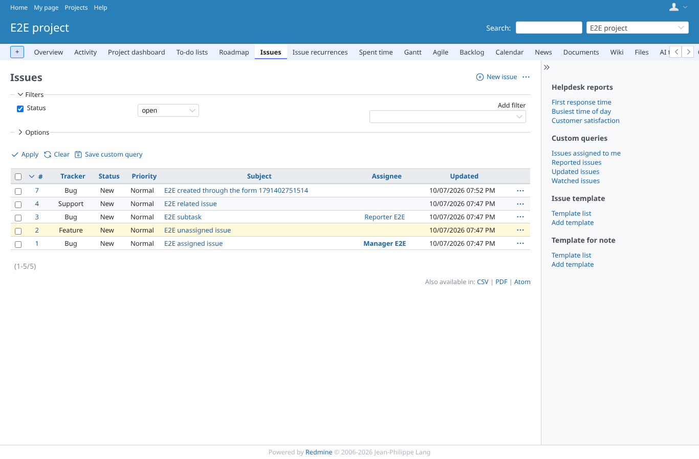
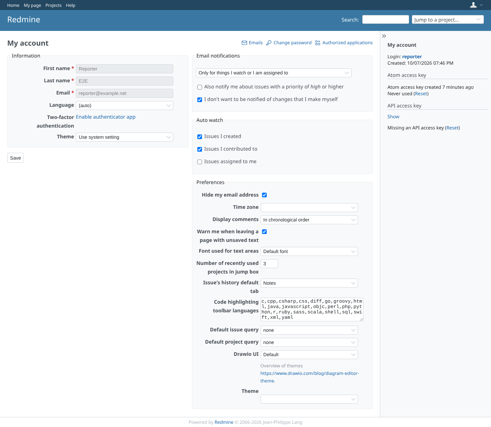
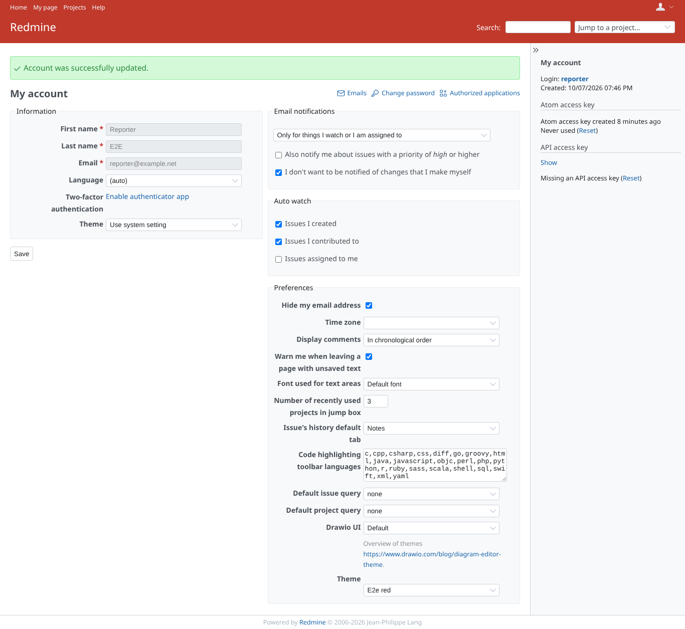
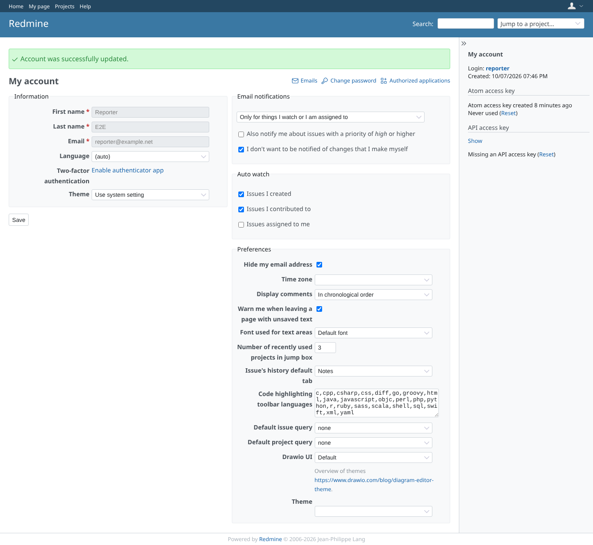
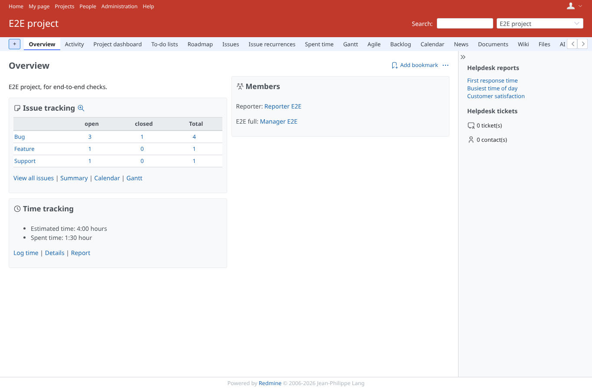
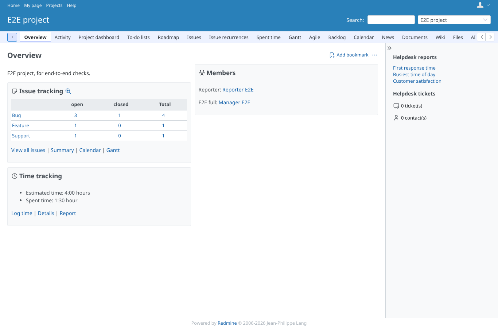
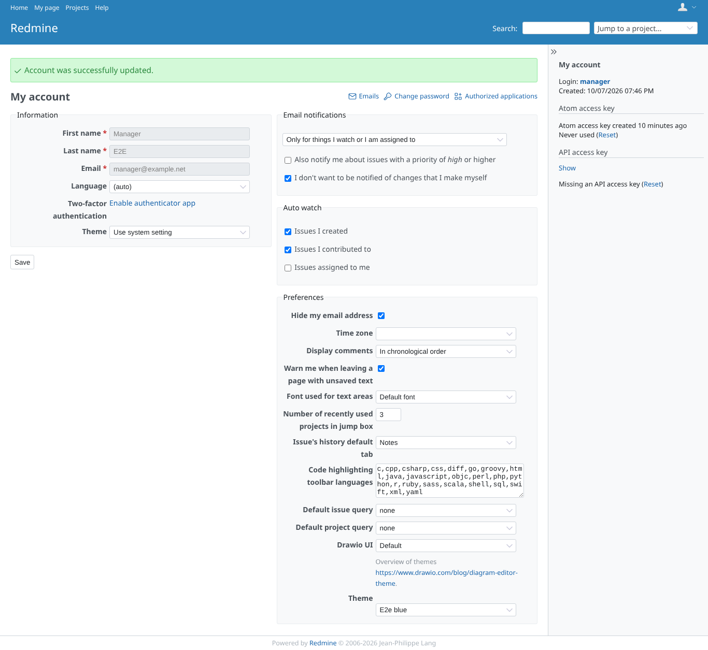
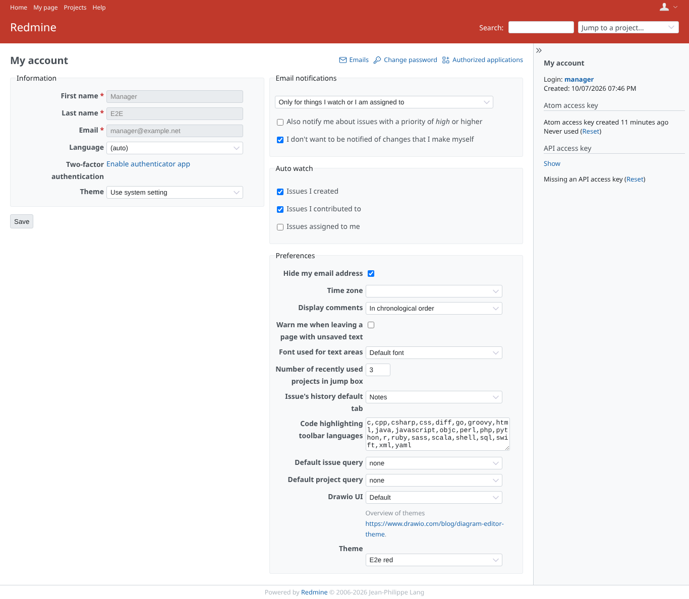

# user-theme

Run 2026-10-07T20:00:28.922Z against http://127.0.0.1:3001.

| screenshot | user | URL | shows |
|---|---|---|---|
|  | manager | `/my/account` | My account: the Theme selector with a blank choice and the two installed themes; nothing chosen, core look |
|  | manager | `/my/account` | After saving: the page is restyled with the red user theme (header, body class, stylesheet) |
|  | manager | `/projects/e2e-project/issues` | The issue list keeps the red theme |
|  | manager | `/projects/e2e-project/issues` | Blue user theme on the issue list: header colour and the theme's own icon sprite |
|  | reporter | `/my/account` | Another user (no plugin permissions needed) keeps the global look while manager has blue |
|  | reporter | `/my/account` | Reporter chooses red; no project permission is involved |
|  | reporter | `/my/account` | Blank choice clears the personal theme |
|  | admin | `/projects/e2e-project` | Global theme red (Administration > Settings > Display) for a user without a choice |
|  | manager | `/projects/e2e-project` | Manager has blue chosen while the global theme is red: personal choice wins |
|  | manager | `/my/account` | After three forged PUTs with invalid theme values the selector still shows the chosen blue theme |
|  | manager | `/my/account` | Theme changed via the REST API (manager:basic auth); a bogus value was ignored |
|  | anonymous | `/login` | Anonymous visitor: global red theme on the login page |
