# theme-changer

Run 2026-10-07T20:35:45.680Z against http://127.0.0.1:3000.

| screenshot | user | URL | shows |
|---|---|---|---|
| 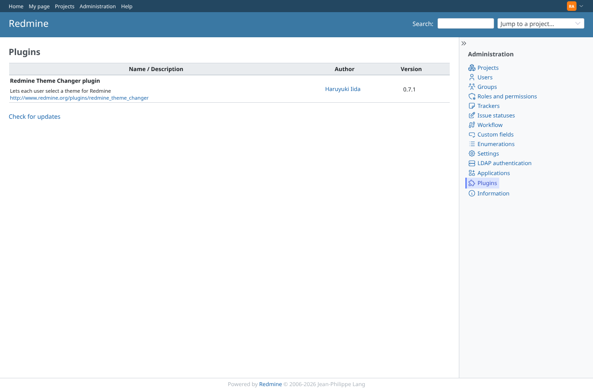 | admin | `/admin/plugins` | Administration > Plugins: Redmine Theme Changer 0.7.1, redmine_user_specific_theme removed |
| 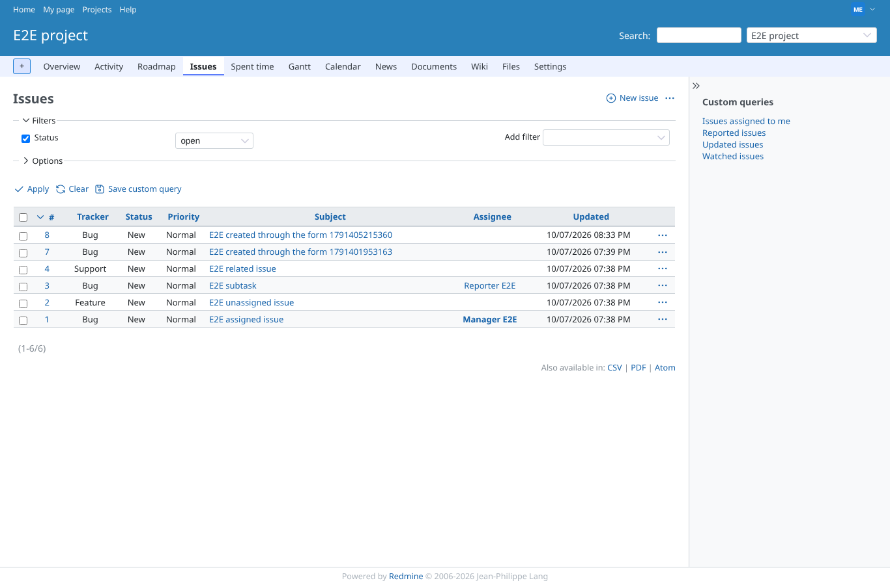 | manager | `/projects/e2e-project/issues` | Manager after the switch: e2e_blue from the conversion (header, body class, the theme's icon sprite) |
| 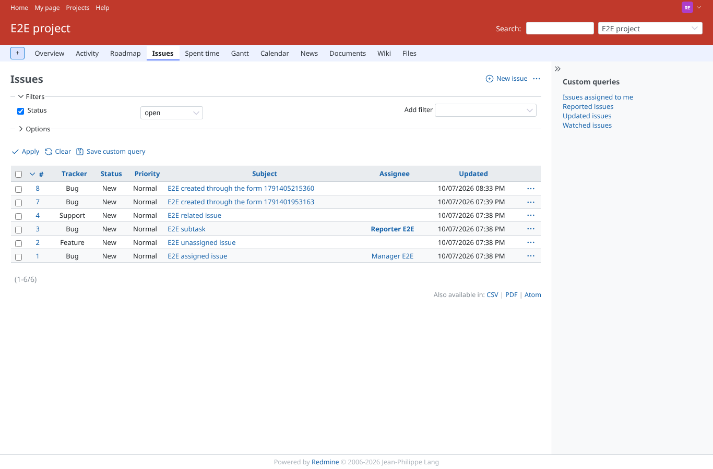 | reporter | `/projects/e2e-project/issues` | Reporter (no plugin permissions) after the switch: e2e_red |
| 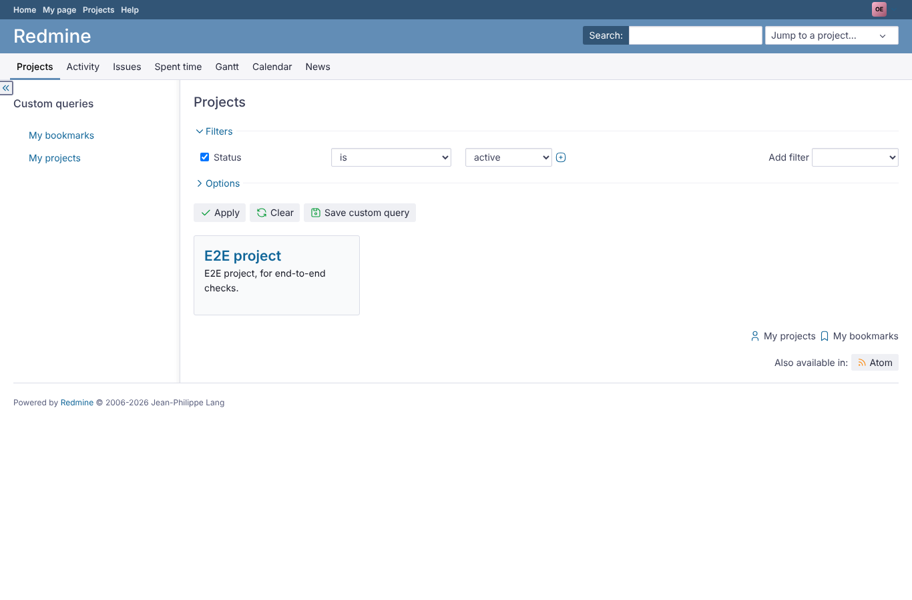 | outsider | `/projects` | Outsider: the PurpleMine2 choice was converted to Opale |
| 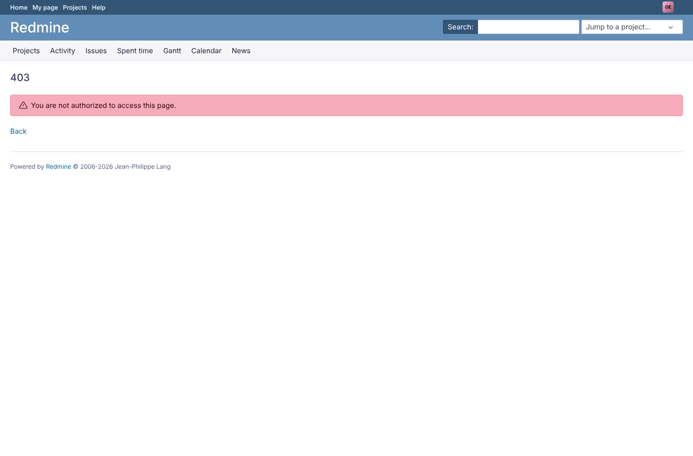 | outsider | `/projects/e2e-private` | Outsider with Opale: the private project stays refused (403) |
| 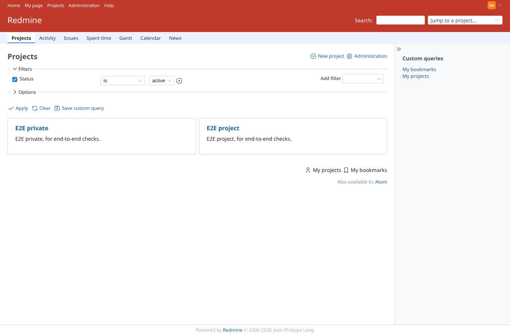 | admin | `/projects` | Administration > Settings > Display = e2e_red: admin (no personal choice) follows it |
| 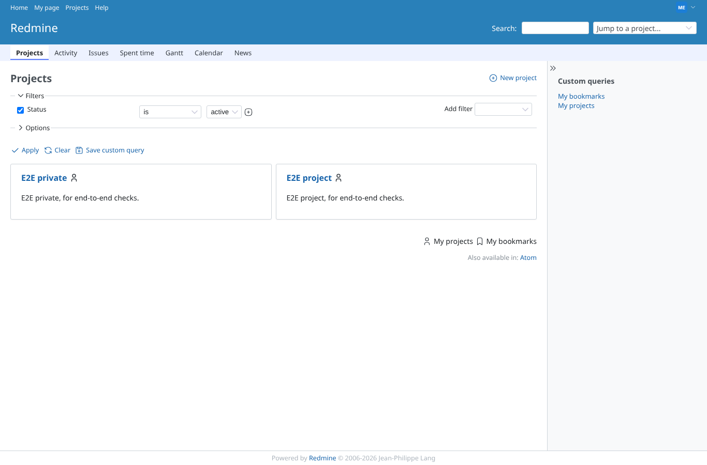 | manager | `/projects` | Manager keeps the personal e2e_blue while the global theme is e2e_red |
|  | reporter | `/my/account` | Reporter picks e2e_blue in theme_changer's selector (My account) |
| 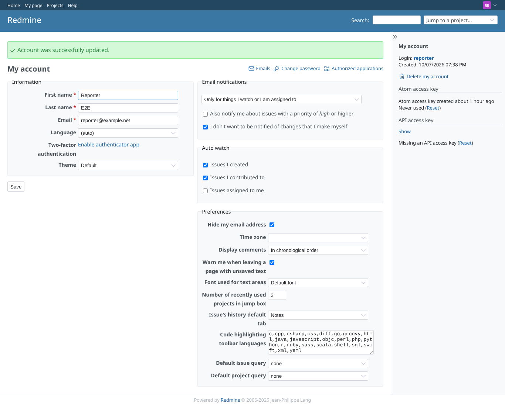 | reporter | `/my/account` | "Default": Redmine's own look, not the global e2e_red |
| 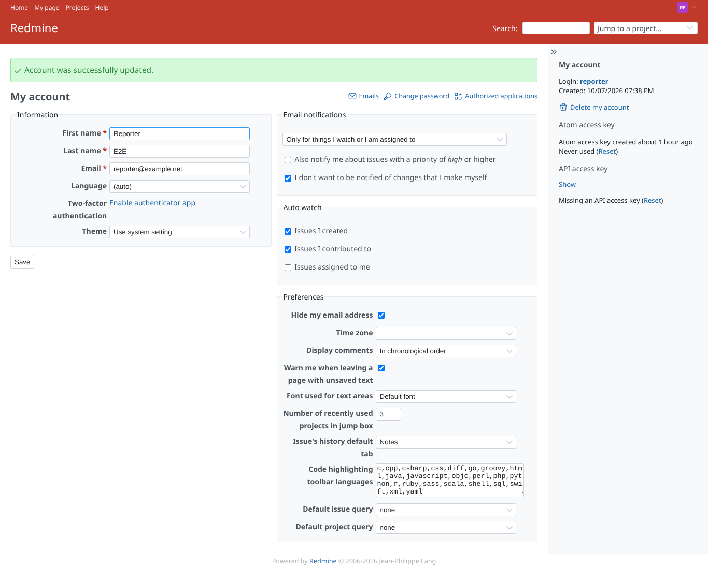 | reporter | `/my/account` | "Use system setting": back to the global e2e_red |
|  | reporter | `/my/account` | Finding: theme_changer stores any pref[theme] value; "nosuchtheme" leaves the user without a theme (core look, not the global red) |
| 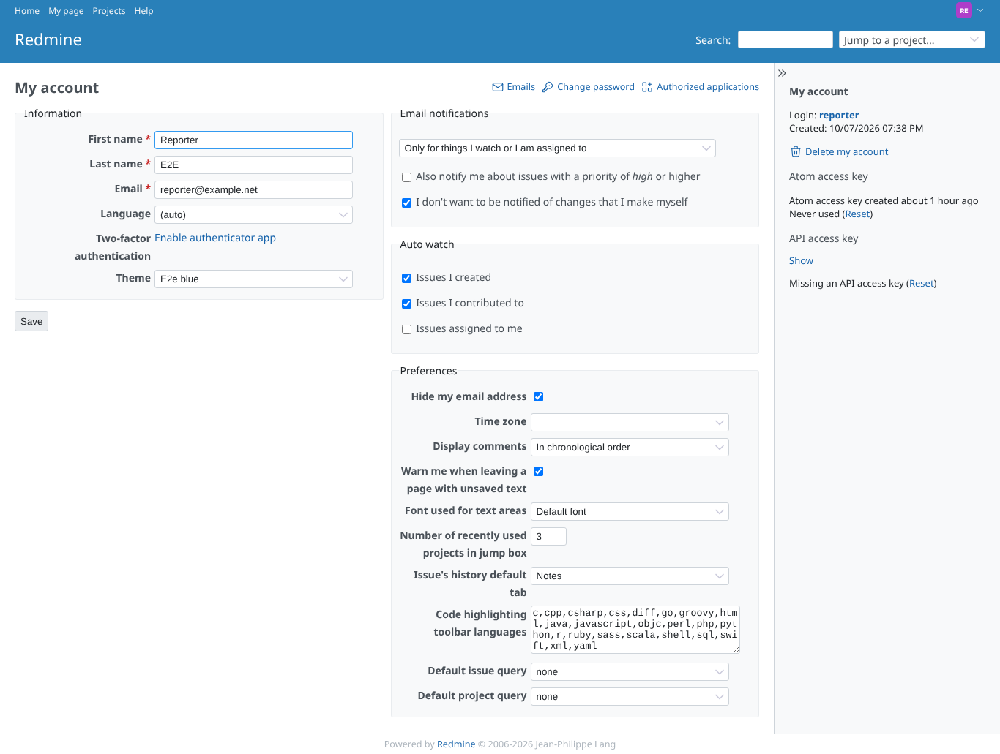 | reporter | `/my/account` | Theme changed through the REST API (PUT /my/account.json, pref.theme) |
| 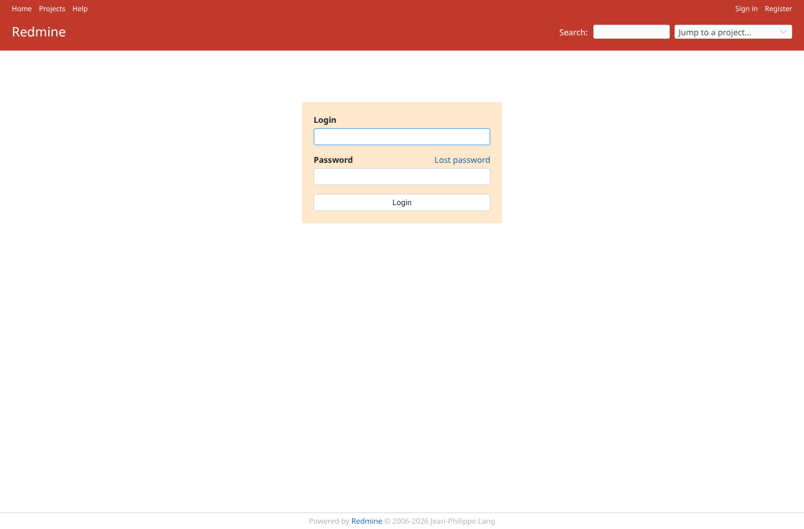 | anonymous | `/login` | Anonymous visitor: the global e2e_red on the login page |
